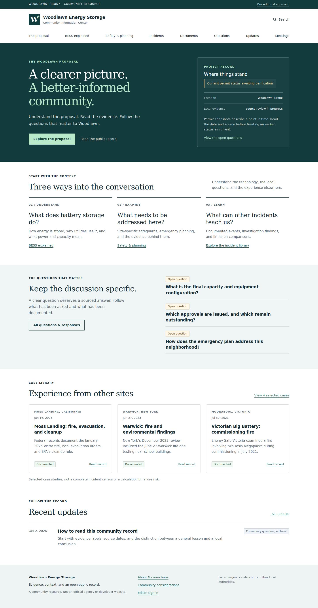

# Woodlawn Energy Storage Information Center

A multi-page community information site with a source-backed case library, document records, questions and responses, updates, meetings, and a protected editorial dashboard. Built with Django, SQLite, Gunicorn, and WhiteNoise. Runs as one non-root Docker container; data lives in a persistent volume.



## Start locally

Requires Docker Engine/Desktop with Docker Compose v2 and Python 3 for the one-time configuration helper.

```sh
git clone https://github.com/medix95417/Bess.git
cd Bess
python3 scripts/configure.py
docker compose up --build -d
docker compose exec web python manage.py createsuperuser
```

Open **http://localhost:8080**. Sign in at **http://localhost:8080/editor/** with the account you just created. There is no default administrator or shared password. The setup script creates a random application secret in the ignored `.env` file.

The first start applies migrations and adds starter content. Seeding is idempotent and does not overwrite edits. Set `SEED_CONTENT=false` after first initialization to avoid re-creating intentionally deleted starter records or resetting the built-in group permission sets.

## What's included

- Public home, proposal overview, technology guide, safety planning, community considerations, and editorial policy.
- Searchable incidents, source/document records, questions, updates, and meetings.
- Four selected incident case studies: McMicken (2019), Victorian Big Battery (2021), Warwick (2023), Moss Landing (2025). This is **not a comprehensive incident census**.
- Optional OpenStreetMap map, loaded only on request. Markers are approximate locality references, not site boundaries or hazard zones.
- Six initial community questions. None is represented as having been sent to an agency.
- Editor dashboard, source citation forms, draft/review/published states, scheduled publication, PDF upload/download, dated evidence review, and revision snapshots with restore-as-draft.
- Contributor and Publisher roles, CSRF protection, escaped content, login throttling, secure-cookie/HTTPS options, private draft downloads, and no bundled credentials.
- Print layout, mobile navigation, keyboard focus styling, and usable content without JavaScript.
- GitHub Actions tests, Docker build, and container startup/restart checks.

## Editorial scope of the first version

The site deliberately keeps local permit and equipment claims in a private review draft until original documents can be attached and current statuses verified. Existing community meeting-packet notes were used to create that review task; the PDF itself is not included in this repository. No new DOB or FDNY portal status was established during the build.

Sources reviewed for starter content are dated **October 2, 2026**. Newer developments must be researched and entered by an editor. Nothing automatically scrapes or publishes updates. Website operator/contact information must be completed before public launch.

See [docs/EDITOR_GUIDE.md](docs/EDITOR_GUIDE.md) for routine editing and [docs/DEPLOYMENT.md](docs/DEPLOYMENT.md) for hosting, backups, restoration, and updates.

## Local development without Docker

```sh
python3 -m venv .venv
. .venv/bin/activate
pip install -r requirements.txt
python scripts/configure.py
set -a
. ./.env
set +a
python manage.py migrate
python manage.py seed_content
python manage.py collectstatic --noinput
python manage.py createsuperuser
gunicorn config.wsgi:application --bind 127.0.0.1:8080
```

For template/static development, set `DEBUG=true` and use `python manage.py runserver 127.0.0.1:8080`. Never use the development server as the public production server.

## Tests

With the environment loaded:

```sh
python manage.py makemigrations --check --dry-run
python manage.py collectstatic --noinput
python manage.py test
```

Tests cover draft/scheduled-content privacy, private PDF access, contributor/publisher boundaries, citation requirements, XSS escaping, CSRF, login throttling, revision restoration, seeding, and public routes.

## Data and source control

Commit application code, migrations, and curated starter content. Never commit `.env`, the SQLite database, uploads, backup archives, or local test credentials. The Docker volume contains editorial data, accounts, and PDFs. A code push is not a content backup.

SQLite is appropriate for a small editorial team and a single application instance. Do not scale this Compose service to multiple replicas sharing the SQLite file. Migrate to PostgreSQL and shared object storage if concurrent editing or traffic requires it.

Leaflet 1.9.4 is vendored with its BSD license in `static/vendor/LEAFLET-LICENSE.txt`. Map tiles require internet access; the rest of the interface uses local assets. Upstream Python package versions are pinned in `requirements.txt`; review security updates before and after launch.
